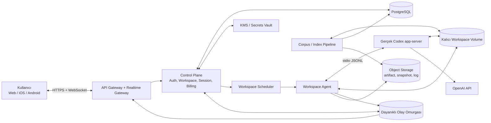
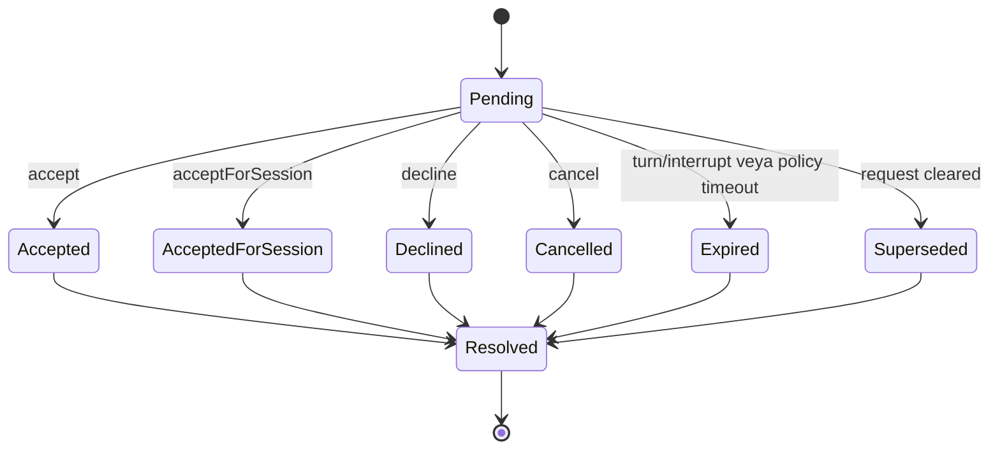
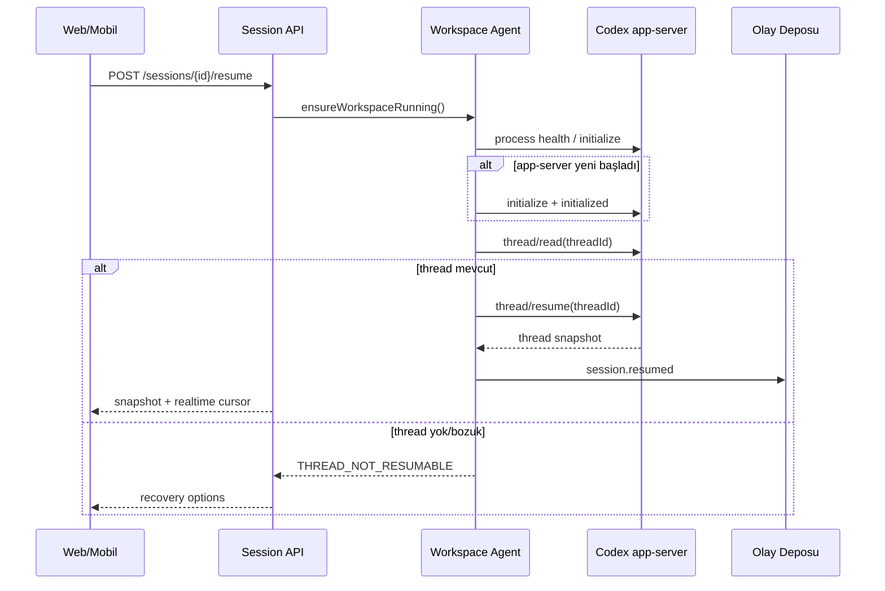
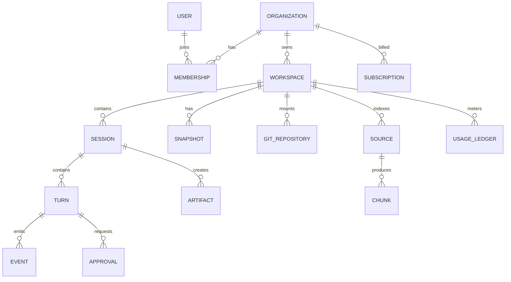
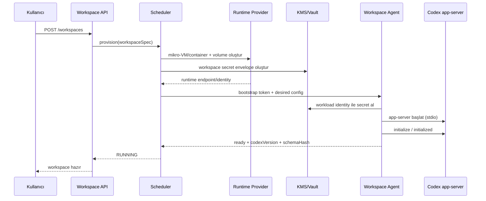
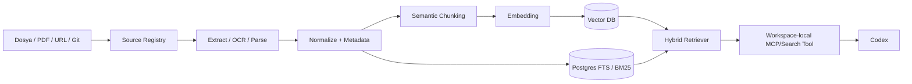
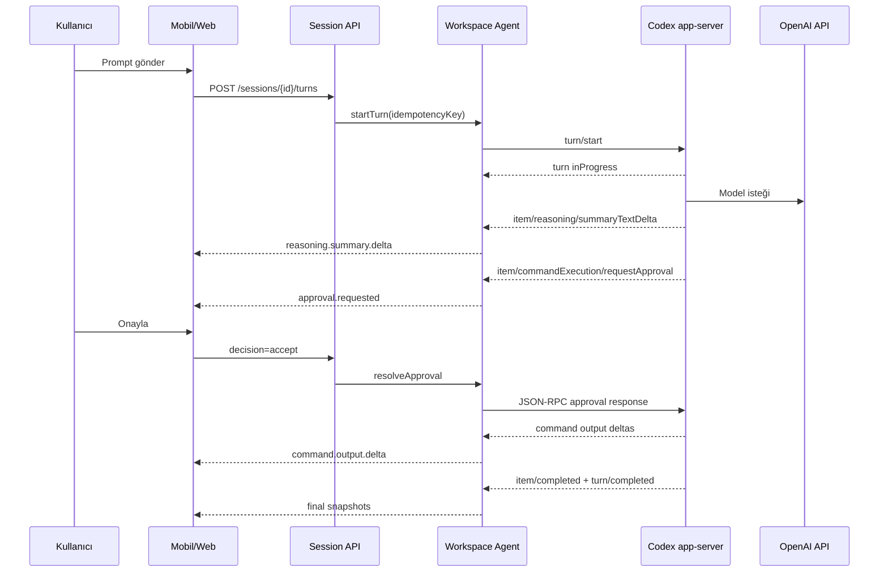

# Persistent Codex Workspace

## Çok Kiracılı, Kalıcı ve Mobil Öncelikli Codex SaaS — Proje Tasarım Spesifikasyonu

**Belge sürümü:** 1.0  
**Tarih:** 14 Temmuz 2026  
**Durum:** Uygulanabilirlik ve MVP tasarım tabanı  
**Hedef okuyucu:** Kurucu, ürün yöneticisi, platform mühendisi, güvenlik mühendisi, mobil/web geliştiricisi

> **Temel karar:** Ürün, Codex'in terminal çıktısını ekran kazıyarak taklit etmeyecek. Her kullanıcı çalışma alanında gerçek `codex app-server` çalıştıracak; kontrol düzlemi, app-server'ın sürüme bağlı JSON-RPC olaylarını normalize edip web/mobil istemcilere aktaracak. Bu, Codex deneyimini yeniden yazmak yerine Codex'in resmî zengin istemci arayüzünü ürünleştirir.

---

## 1. Yönetici özeti

Bu ürün her kullanıcıya veya takıma kalıcı bir Linux çalışma alanı sağlar. Çalışma alanı bir mikro-VM ya da güçlü biçimde izole edilmiş container içinde yaşar; dosya sistemi, Git geçmişi, Codex oturumları, araçlar ve isteğe bağlı corpus/indeks katmanı yeniden başlatmalardan sonra korunur. Kullanıcı web veya mobil uygulamadan prompt gönderir. Arka planda gerçek OpenAI Codex CLI dağıtımının `app-server` süreci OpenAI API anahtarıyla çalışır. Ürün arayüzü Codex'in yayınladığı thread, turn, item, delta ve approval olaylarını kendi dayanıklı olay modeline çevirir.

Codex'in resmî dokümantasyonu, `app-server`ı zengin istemciler için önerilen arabirim olarak tanımlar; konuşma geçmişi, onaylar ve akışlı ajan olaylarını destekler. Protokol JSON-RPC benzeri çift yönlü mesajlaşma kullanır; `stdio` taşıması JSONL'dir. WebSocket taşıması mevcut belgelerde deneysel ve desteklenmeyen olarak işaretlendiği için MVP'de app-server ile Workspace Agent arasındaki bağlantı `stdio` olmalıdır. [Codex App Server dokümantasyonu](https://learn.chatgpt.com/docs/app-server)

Ürünün ayırt edici değeri yalnız “uzaktaki Codex” değildir. Değer önerisi şudur:

- Codex'in gerçek orkestrasyonu ve olay semantiği korunur.
- Çalışma alanı, Git geçmişi ve kullanıcı bilgisi kalıcıdır.
- Bir görev telefonda başlatılıp webde sürdürülebilir; bağlantı kopsa bile çalışma devam eder.
- Komutlar, çıktı, diff, onay ve plan durumu tek bir denetlenebilir zaman çizelgesinde görünür.
- Her kiracı güçlü biçimde izole edilir; anahtarlar uygulama veritabanında düz metin olarak tutulmaz.
- OpenAI maliyeti, compute, disk ve indeks maliyeti ayrı sayaçlarla ölçülür.

### 1.1 Önerilen ürün adı ve konumlandırma

Geçici ad: **Persistent Codex Workspace**  
Konumlandırma: **“Codex için kalıcı, her yerden erişilen çalışma alanı.”**

Marka metninde “OpenAI Codex'in kendisi” veya “resmî Codex uygulaması” izlenimi verilmemelidir. “Powered by Codex CLI” gibi ifadeler ancak OpenAI marka yönergeleri ve hukuki inceleme sonrasında kullanılmalıdır.

### 1.2 Mimari seçim özeti

| Alan | Karar |
|---|---|
| Codex entegrasyonu | Her workspace içinde `codex app-server` |
| App-server taşıması | MVP: yerel `stdio`/JSONL; ileride kontrollü Unix socket |
| İstemci akışı | Gateway üzerinden WebSocket; kaçırılan olaylar için REST replay |
| İş yükü izolasyonu | Tercihen Firecracker/Kata mikro-VM; MVP'de sıkı container + tenant başına node/pool politikası |
| Kalıcı disk | Tenant workspace volume + ayrı şifreli yedek/snapshot |
| Oturum kaydı | Codex thread kimliği + platform olay günlüğü + Codex `CODEX_HOME` |
| Terminal | `command/exec` ve app-server background terminal yetenekleri; tmux yalnız kullanıcı kabuğu/fallback |
| Kimlik bilgisi | Platforma ait OpenAI API anahtarı veya kurumsal BYOK; KMS/Vault ile envelope encryption |
| Corpus | Ayrı ingestion/index servisi; dosya sistemi doğruluk kaynağı, indeks türetilmiş veri |
| Çok kiracılık | Control plane paylaşımlı; data plane workspace başına izole |
| Sürümleme | Codex sürümü pinli; her sürümde `generate-ts`/JSON Schema ve sözleşme testleri |

---

## 2. Ürün hedefleri ve hedef dışı alanlar

### 2.1 Hedefler

1. Gerçek Codex CLI/app-server davranışını kullanmak; model çağrıları ve araç orkestrasyonunu yeniden uygulamamak.
2. Ajan çalışmasını web ve mobilde canlı, anlaşılır ve denetlenebilir göstermek.
3. Bağlantı kesintisine dayanıklı, sürdürülebilir ve yeniden oynatılabilir oturumlar sunmak.
4. Dosyaları, Git geçmişini, proje talimatlarını, becerileri ve corpus'u kalıcı tutmak.
5. Kullanıcı onayını komut, dosya değişikliği, ağ erişimi ve harici araç çağrılarında birinci sınıf ürün nesnesi yapmak.
6. Kiracılar arasında dosya, işlem, ağ, kimlik bilgisi ve gözlemlenebilirlik verisi izolasyonu sağlamak.
7. Kullanım başına maliyet ölçümü, kota, bütçe ve faturalama kurmak.
8. Codex protokol değişikliklerine uyum için sürüm pinleme ve şema adaptörleri kullanmak.

### 2.2 Hedef dışı alanlar

- OpenAI'nin kapalı kaynak Codex masaüstü UI'ını piksel düzeyinde kopyalamak.
- Modelin gizli chain-of-thought içeriğini elde etmek veya yeniden üretmek.
- ChatGPT Pro/Plus aboneliğini proxy ederek üçüncü taraf kullanıcılar adına kullanmak.
- OpenAI API anahtarını müşterilere satmak, devretmek veya istemciye ifşa etmek.
- İlk MVP'de tam IDE, bulut masaüstü veya genel amaçlı PaaS olmak.
- Vektör indeksini tek “hafıza” kaynağı kabul etmek; çalışma alanı dosyaları ve Git doğruluk kaynağıdır.

### 2.3 Başarı ölçütleri

| Ölçüt | MVP hedefi |
|---|---:|
| Prompt kabulünden ilk UI olayına p95 | < 1,5 sn |
| App-server olayından istemci teslimine p95 | < 500 ms |
| Bağlantı sonrası olay replay başarısı | %99,9 |
| Workspace yeniden başlatma sonrası thread resume | %99 |
| Kaybolan/çift uygulanan onay kararı | 0 |
| Kiracılar arası veri sızıntısı | 0; release blocker |
| Kullanım kayıtları ile fatura sapması | <%1 |
| Codex sürüm yükseltme sözleşme test kapsamı | Tüm desteklenen normalize olay türleri |

---

## 3. Resmî Codex yüzeyi ve tasarıma etkileri

### 3.1 Neden `app-server`?

`codex exec --json` otomasyon ve CI için kullanışlıdır; fakat etkileşimli ürün için çift yönlü onay, thread yönetimi ve zengin olay akışı gerekir. Codex SDK da sunucu tarafı entegrasyon için uygundur; ancak en yüksek UI sadakati ve protokol kontrolü app-server ile elde edilir. Resmî doküman, app-server'ı Codex'in VS Code uzantısı gibi zengin istemcileri güçlendiren arabirim olarak tanımlar; SDK dokümanı ise uygulama içi ve programatik kontrolü desteklediğini açıklar. [App Server](https://learn.chatgpt.com/docs/app-server), [Codex SDK](https://learn.chatgpt.com/docs/codex-sdk)

### 3.2 Temel protokol nesneleri

- **Thread:** Kullanıcı ile Codex arasındaki kalıcı konuşma; birden fazla turn içerir.
- **Turn:** Tek kullanıcı isteği ve onu takip eden ajan çalışması.
- **Item:** Mesaj, reasoning özeti, plan, komut, dosya değişikliği, MCP çağrısı gibi bir iş birimi.

Önemli yöntemler: `thread/start`, `thread/resume`, `thread/read`, `thread/list`, `thread/fork`, `turn/start`, `turn/steer`, `turn/interrupt`, `thread/compact/start`. Thread ve turn yaşam döngüsü resmî protokol tarafından yayınlanır. [App Server — Threads and Turns](https://learn.chatgpt.com/docs/app-server#threads)

### 3.3 UI'da yansıtılabilen öğeler

App-server'ın belgelenmiş `ThreadItem` türleri arasında `userMessage`, `agentMessage`, `plan`, `reasoning`, `commandExecution`, `fileChange`, `mcpToolCall`, `dynamicToolCall`, `collabToolCall`, `webSearch`, `imageView`, review modu ve context compaction bulunur. Komut item'ı komut, çalışma dizini, durum, birikmiş çıktı, çıkış kodu ve süreyi; dosya item'ı path, kind ve diff'i taşıyabilir. [App Server — Items](https://learn.chatgpt.com/docs/app-server#items)

Akışta özellikle şu delta olayları kullanılabilir:

- `item/agentMessage/delta`
- `item/plan/delta`
- `item/reasoning/summaryTextDelta`
- `item/reasoning/summaryPartAdded`
- `item/reasoning/textDelta` — yalnız model ve yapılandırma destekliyorsa
- `item/commandExecution/outputDelta`
- `turn/diff/updated`
- `thread/tokenUsage/updated`

`item/completed` son item durumunun doğruluk kaynağı kabul edilmelidir. Plan deltalarının birleşimi nihai plan item'ıyla birebir aynı olmayabilir; UI son item geldiğinde ara görünümü reconcile etmelidir.

### 3.4 UI'da yansıtılamayan veya garanti edilemeyen öğeler

1. **Gizli chain-of-thought:** Ürün bunu talep etmemeli, saklamamalı ve “tam düşünce akışı” iddiasında bulunmamalıdır. Yalnız app-server'ın sunduğu reasoning summary ve varsa açık reasoning event'leri gösterilebilir.
2. **Codex masaüstü uygulamasına birebir UI eşitliği:** App-server semantiği taşır; özel animasyon, iç durum ve yayımlanmamış istemci mantığı garanti edilmez.
3. **Her dosya okumasının eksiksiz kaydı:** Açık `commandExecution`, tool veya hook olaylarından çıkarılabilir; ancak tüm dahili bağlam seçimi veya model tarafı okuma kararları ayrı item olarak yayınlanmayabilir.
4. **Kararlı deneysel API:** WebSocket app-server taşıması, background terminal listeleme ve bazı pagination/dynamic tool yüzeyleri deneysel olabilir. Ürün bunları özellik bayrağı arkasında tutmalıdır.
5. **API anahtarıyla ChatGPT plan özellikleri:** API key auth, ChatGPT abonelik hakları veya ChatGPT'ye özgü rate-limit/usage yüzeylerini sağlamaz. `CODEX_API_KEY` yalnız `codex exec` için belgelenmiştir; app-server API-key oturumu için `account/login/start` veya güvenli, workspace'e özel Codex auth durumu kullanılmalıdır. [Environment Variables](https://learn.chatgpt.com/docs/config-file/environment-variables), [Authentication](https://learn.chatgpt.com/docs/auth)
6. **Maliyet alanlarının tamlığı:** Thread token usage olayları UI'ı besleyebilir; resmi faturalama kaydı ile platform ölçümü gerektiğinde OpenAI usage/billing kaydı ayrıca reconcile edilmelidir.

---

## 4. Sistem bağlamı



### 4.1 Control plane

Paylaşımlı, yatay ölçeklenen servislerdir:

- Kullanıcı/organizasyon kimliği ve RBAC
- Workspace yaşam döngüsü ve scheduler
- Session/thread eşleme
- Realtime subscription ve olay replay
- Approval yönlendirme
- Billing, kota ve bütçe
- Audit log ve yönetim
- Workspace sürüm/health envanteri

Control plane, tenant workspace dosya sistemini doğrudan mount etmemelidir. Gerekli işlemler karşılıklı kimlik doğrulamalı Workspace Agent RPC'siyle yapılır.

### 4.2 Data plane

Her workspace'in güvenlik sınırıdır:

- Mikro-VM/container
- Kalıcı disk
- Workspace Agent (PID 1 veya denetlenen servis)
- Pinli Codex CLI/app-server
- Projeye özel `CODEX_HOME`
- Git, dil araç zincirleri ve optional tmux
- Corpus watcher/sidecar veya güvenli queue tabanlı ingestion istemcisi

### 4.3 Workspace Agent'ın sorumluluğu

Workspace Agent model/ajan orkestrasyonu yapmaz. Aşağıdaki adapter ve supervisor işlerini yapar:

1. App-server sürecini başlatır ve health-check eder.
2. `initialize`/`initialized` el sıkışmasını yürütür.
3. Codex sürümünü ve üretilmiş şema hash'ini raporlar.
4. JSON-RPC isteklerini correlation id ile yollar.
5. Bildirimleri sıralı bir workspace event stream'e çevirir.
6. Sunucu tarafından başlatılan approval/user-input isteklerini durably kaydeder.
7. `stdout` protokolünü ve `stderr` tanı loglarını ayırır.
8. Crash sonrası app-server'ı kontrollü yeniden başlatır ve thread'i resume eder.
9. Disk, process, CPU, bellek ve ağ kotalarını uygular/raporlar.
10. App-server'a kullanıcı API anahtarını yalnız çalıştırma anında enjekte eder.

---

## 5. Codex olay eşleme katmanı

### 5.1 Temel ilke: ham olay + normalize görünüm

Her app-server mesajı iki biçimde tutulmalıdır:

- **Raw event:** Sürüm, timestamp ve checksum ile değişmeden; hassas alanlar policy ile redakte/şifreli.
- **Normalized event:** UI ve domain servislerinin kullandığı kararlı platform şeması.

Bu çift kayıt, protokol yükseltmelerinde geçmiş oturumları yeniden işleme ve hata ayıklama imkânı verir. Raw payload'ın süresiz saklanması gerekmez; kurumsal retention politikasına göre 7–30 gün, normalize olaylar 90 gün veya sözleşmeye göre saklanabilir.

### 5.2 Ortak event envelope

```json
{
  "eventId": "evt_01J...",
  "schemaVersion": 1,
  "tenantId": "ten_123",
  "workspaceId": "wsp_123",
  "sessionId": "ses_123",
  "codexThreadId": "thr_123",
  "codexTurnId": "turn_456",
  "codexItemId": "item_789",
  "sequence": 1842,
  "occurredAt": "2026-07-14T12:34:56.123Z",
  "receivedAt": "2026-07-14T12:34:56.181Z",
  "source": "codex-app-server",
  "sourceVersion": "0.x.y",
  "sourceMethod": "item/commandExecution/outputDelta",
  "type": "command.output.delta",
  "visibility": "user",
  "payload": {},
  "integrity": {
    "previousEventHash": "sha256:...",
    "eventHash": "sha256:..."
  }
}
```

**Sıralama:** `sequence` workspace/session stream'i içinde monotonic olmalıdır. Client, aynı `eventId` için idempotent işlem yapar. Gateway resume token olarak son `sequence` değerini kabul eder.

### 5.3 Normalize olay kataloğu

| Platform olayı | Codex kaynağı | UI gösterimi |
|---|---|---|
| `session.started` | `thread/start` cevabı / `thread/started` | Yeni görev başlığı, model, cwd |
| `session.resumed` | `thread/resume` cevabı | “Oturum sürdürüldü” |
| `turn.started` | `turn/started` | Aktif çalışma göstergesi |
| `turn.completed` | `turn/completed` | Başarılı/başarısız/kesildi |
| `agent.message.delta` | `item/agentMessage/delta` | Akışlı commentary/final metni |
| `agent.message.completed` | `item/completed: agentMessage` | Nihai mesaj snapshot'ı |
| `reasoning.summary.delta` | `item/reasoning/summaryTextDelta` | “Durum / yaklaşım” kartı |
| `reasoning.raw.delta` | `item/reasoning/textDelta` | Varsayılan kapalı; destek varsa policy'ye bağlı |
| `plan.delta` | `item/plan/delta` | Geçici plan |
| `plan.completed` | `item/completed: plan` | Yetkili plan snapshot'ı |
| `command.proposed` | `item/started: commandExecution` | Komut, cwd, risk rozeti |
| `command.output.delta` | `item/commandExecution/outputDelta` | Canlı terminal stdout/stderr akışı |
| `command.completed` | `item/completed: commandExecution` | Exit code, süre, sonuç |
| `file.change.proposed` | `item/started: fileChange` | Dosya listesi ve diff |
| `file.change.completed` | `item/completed: fileChange` | Uygulandı/reddedildi/başarısız |
| `diff.updated` | `turn/diff/updated` | Turn toplam diff görünümü |
| `tool.started` | `item/started: mcpToolCall/dynamicToolCall` | Sunucu, araç, argüman özeti |
| `tool.completed` | `item/completed` | Sonuç/hata |
| `approval.requested` | server request | Yapışkan onay kartı |
| `approval.resolved` | `serverRequest/resolved` | Karar, karar sahibi, zaman |
| `token.usage.updated` | `thread/tokenUsage/updated` | Maliyet/kota tahmini |
| `context.compacted` | `contextCompaction` item | Bağlam sıkıştırıldı işareti |
| `error.reported` | `error` | Hata sınıfı ve retry UX |

### 5.4 Komut çıktı şeması

```json
{
  "type": "command.output.delta",
  "payload": {
    "commandId": "item_789",
    "stream": "combined",
    "chunkIndex": 42,
    "encoding": "utf-8",
    "text": "PASS src/auth.test.ts\n",
    "byteLength": 22,
    "truncated": false
  }
}
```

Codex item delta'sı stdout ve stderr'i ayrıştırmıyorsa ürün “combined” göstermelidir; tahmin yoluyla stderr etiketi üretmemelidir. `command/exec/outputDelta` gibi ayrı base64 akışlarında protokolün sunduğu stream bilgisi korunur.

### 5.5 Dosya değişikliği şeması

```json
{
  "type": "file.change.proposed",
  "payload": {
    "status": "in_progress",
    "changes": [
      {
        "path": "src/auth/session.ts",
        "kind": "update",
        "diff": "@@ -18,6 +18,9 @@ ...",
        "language": "typescript",
        "isBinary": false
      }
    ],
    "aggregate": {
      "files": 1,
      "additions": 3,
      "deletions": 0
    }
  }
}
```

Diff parse edilemiyorsa ham diff gösterilir; sunucu tarafı “additions/deletions” alanları nullable olur. Binary dosyada diff yerine metadata ve artifact preview kullanılır.

### 5.6 Approval şeması ve durum makinesi

```json
{
  "approvalId": "apr_01J...",
  "requestId": "rpc_991",
  "tenantId": "ten_123",
  "workspaceId": "wsp_123",
  "threadId": "thr_123",
  "turnId": "turn_456",
  "itemId": "item_789",
  "kind": "command_execution",
  "status": "pending",
  "reason": "Paket indirmek için ağ erişimi gerekiyor.",
  "requestedAt": "2026-07-14T12:35:00Z",
  "expiresAt": null,
  "availableDecisions": ["accept", "accept_for_session", "decline", "cancel"],
  "resource": {
    "command": "npm install",
    "cwd": "/workspace/project",
    "network": {"host": "registry.npmjs.org", "protocol": "https", "port": 443}
  },
  "resolvedBy": null,
  "decision": null,
  "version": 1
}
```



Karar endpoint'i optimistic locking kullanır. `version` veya `If-Match` uyuşmazsa `409 APPROVAL_ALREADY_RESOLVED` döner. Önce veritabanında karar niyeti atomik yazılır, sonra app-server'a cevap verilir; cevap sonrası `serverRequest/resolved` ile durum kesinleştirilir. Workspace çökmesi halinde pending request, app-server yeniden bağlandığında geçersiz olabilir; UI bunu “süresi doldu/oturum yeniden başlatıldı” olarak kapatır.

---

## 6. Gerçek zamanlı deneyim ve mobil UI

### 6.1 Görev ekranı

Tek bir kronolojik timeline; ancak bilgi yoğunluğu katmanlıdır:

1. Kullanıcı mesajı
2. Codex durum özeti/commentary
3. Plan kartı
4. Komut kartı — başlangıçta tek satır; açılınca terminal çıktısı
5. Dosya değişikliği kartı — dosya listesi ve unified/split diff
6. Tool/MCP kartı
7. Yapışkan approval kartı
8. Final cevap

Mobilde terminal ve diff varsayılan kapalı olmalıdır. Kullanıcı “Ayrıntılar” ile açar. Approval kartı ekranın altına sabitlenir ve komut/diff bağlamını tek dokunuşla açar.

### 6.2 Akış protokolü

İstemci `wss://api.example.com/v1/realtime?workspaceId=...` bağlantısı kurar:

```json
{"type":"subscribe","sessionId":"ses_123","afterSequence":1838}
```

Gateway önce olay deposundan 1839 ve sonrasını replay eder, sonra canlı bus'a geçer. Replay ile live subscribe arasında boşluk bırakmamak için high-water mark yaklaşımı kullanılır:

1. Bus consumer high-water sequence'i alır.
2. DB'den `afterSequence < seq <= highWater` replay edilir.
3. Bus'tan `seq > highWater` canlı akış başlar.

İstemci her 20–50 olayda bir ack yollar. Ack faturalama için değil, yeniden bağlanma optimizasyonu içindir.

### 6.3 Bağlantı kopması

- Mobil uygulama kapanırsa turn workspace'te devam eder.
- Push notification yalnız anlamlı durumlarda gönderilir: approval, turn completed, failed, budget threshold.
- Kullanıcı geri döndüğünde REST snapshot + event replay alınır.
- Delta kaybı varsa `item/completed` snapshot'ı UI'yı düzeltir.
- Çok büyük terminal akışları UI WebSocket'inde örneklenebilir; tam çıktı object storage'da sıkıştırılmış artifact olarak saklanır.

### 6.4 Çoklu cihaz

Bir thread'e birden fazla cihaz bağlanabilir. Hepsi olayları izler; approval kararı ilk geçerli yazan kazanır. `turn/steer` ve yeni prompt için kullanıcı/cihaz kimliği audit edilir. Aynı thread'de aynı anda yalnız bir aktif turn varsayımı korunur; ikinci prompt ya `turn/steer` olarak açıkça gönderilir ya da kuyruklanır.

---

## 7. Session, process ve terminal yaşam döngüsü

### 7.1 Katmanlar

- **Product Session:** Kullanıcıya görünen görev kaydı.
- **Codex Thread:** `thread.id`; konuşmanın gerçek Codex kimliği.
- **Codex Turn:** tek aktif iş.
- **App-server Process:** workspace içindeki uzun ömürlü supervisor child process.
- **Terminal Process:** Codex komut item'ları, `command/exec` PTY'leri veya kullanıcı kabuğu.

### 7.2 Neden tmux çekirdek protokol değildir?

tmux, elle açılan terminal oturumları ve operasyonel kurtarma için değerlidir; ancak Codex UI olaylarının kaynağı olamaz. Terminal ekranını parse etmek, approval ve item semantiğini kaybettirir. Ana akış app-server'dır. tmux şu alanlarda kullanılabilir:

- Kullanıcının ayrı “Shell” sekmesi
- Uzun süren manuel dev server
- Operatör break-glass tanısı
- App-server dışındaki yardımcı süreçler

App-server'ın PTY/`command/exec` yetenekleri yeterliyse tmux MVP'den çıkarılabilir.

### 7.3 Resume algoritması



Recovery seçenekleri:

1. Son Git commit/snapshot'tan yeni thread başlat.
2. Mevcut dosya sistemiyle yeni thread başlat ve önceki final özetini bağlam olarak ekle.
3. Support export oluştur; gizli verileri redakte et.

### 7.4 Workspace sleep/wake

- Aktif turn, approval bekleme veya terminal varsa workspace uyutulmaz.
- Idle timeout sonrası process durdurulur; disk volume korunur.
- Wake sırasında image sürümü, volume, `CODEX_HOME`, secret mount ve agent başlatılır.
- Codex binary sürümü session ortasında otomatik değiştirilmez.

---

## 8. Public API tasarımı

### 8.1 Kimlik ve organizasyon

| Method | Endpoint | Açıklama |
|---|---|---|
| `POST` | `/v1/auth/session` | Web/mobile oturumu |
| `GET` | `/v1/me` | Kullanıcı ve yetkiler |
| `GET` | `/v1/organizations/{orgId}` | Organizasyon |
| `GET` | `/v1/organizations/{orgId}/members` | Üyeler/RBAC |

### 8.2 Workspace

| Method | Endpoint | Açıklama |
|---|---|---|
| `POST` | `/v1/workspaces` | Workspace provision et |
| `GET` | `/v1/workspaces` | Listele |
| `GET` | `/v1/workspaces/{workspaceId}` | Durum/kapasite/sürüm |
| `POST` | `/v1/workspaces/{workspaceId}/start` | Wake/start |
| `POST` | `/v1/workspaces/{workspaceId}/stop` | Graceful stop |
| `POST` | `/v1/workspaces/{workspaceId}/snapshot` | Disk snapshot |
| `POST` | `/v1/workspaces/{workspaceId}/restore` | Yeni workspace'e restore |
| `DELETE` | `/v1/workspaces/{workspaceId}` | Gecikmeli silme |

### 8.3 Session/turn

| Method | Endpoint | Açıklama |
|---|---|---|
| `POST` | `/v1/workspaces/{workspaceId}/sessions` | `thread/start` |
| `GET` | `/v1/sessions/{sessionId}` | Normalize snapshot |
| `GET` | `/v1/sessions/{sessionId}/events?after=` | Olay replay |
| `POST` | `/v1/sessions/{sessionId}/turns` | `turn/start` |
| `POST` | `/v1/sessions/{sessionId}/turns/{turnId}/steer` | `turn/steer` |
| `POST` | `/v1/sessions/{sessionId}/turns/{turnId}/interrupt` | `turn/interrupt` |
| `POST` | `/v1/sessions/{sessionId}/resume` | Workspace wake + `thread/resume` |
| `POST` | `/v1/sessions/{sessionId}/fork` | `thread/fork` |
| `POST` | `/v1/sessions/{sessionId}/archive` | Arşivle |

`POST /turns` idempotency anahtarı kabul etmelidir:

```http
Idempotency-Key: 9c30f96a-...
```

### 8.4 Approval

| Method | Endpoint | Açıklama |
|---|---|---|
| `GET` | `/v1/approvals?status=pending` | Kullanıcının bekleyen onayları |
| `GET` | `/v1/approvals/{approvalId}` | Bağlam ve sürüm |
| `POST` | `/v1/approvals/{approvalId}/decision` | Karar ver |

Karar gövdesi:

```json
{
  "decision": "accept_for_session",
  "expectedVersion": 1,
  "clientContext": {
    "deviceId": "dev_123",
    "reason": null
  }
}
```

### 8.5 Dosya, Git ve artifact

| Method | Endpoint | Açıklama |
|---|---|---|
| `GET` | `/v1/workspaces/{id}/tree?path=` | Dosya ağacı |
| `GET` | `/v1/workspaces/{id}/files/content?path=` | Güvenli dosya okuma |
| `GET` | `/v1/workspaces/{id}/git/status` | Git durumu |
| `GET` | `/v1/workspaces/{id}/git/diff` | Diff |
| `GET` | `/v1/workspaces/{id}/git/log` | Commit geçmişi |
| `POST` | `/v1/workspaces/{id}/git/commit` | Kullanıcı eylemi; ayrı approval/policy |
| `GET` | `/v1/artifacts/{artifactId}` | Kısa ömürlü imzalı indirme |

Path parametreleri canonicalize edilir; `..`, symlink escape ve proc/sysfs erişimi engellenir.

### 8.6 Corpus

| Method | Endpoint | Açıklama |
|---|---|---|
| `POST` | `/v1/workspaces/{id}/sources` | Kaynak ekle/yükle |
| `GET` | `/v1/workspaces/{id}/sources` | Durum |
| `POST` | `/v1/sources/{sourceId}/reindex` | Yeniden indeksle |
| `DELETE` | `/v1/sources/{sourceId}` | Kaynak + türevleri sil |
| `POST` | `/v1/workspaces/{id}/search` | Hybrid retrieval |

---

## 9. Veri modeli



### 9.1 Çekirdek tablolar

**organizations**

- `id`, `name`, `plan`, `region`, `data_retention_policy_id`
- `created_at`, `deleted_at`

**users**

- `id`, `auth_subject`, `email`, `status`
- `created_at`, `last_seen_at`

**memberships**

- `organization_id`, `user_id`, `role`
- Roller: `owner`, `admin`, `developer`, `viewer`, `billing`

**workspaces**

- `id`, `organization_id`, `owner_user_id`, `name`, `slug`
- `runtime_class`, `region`, `status`, `desired_status`
- `volume_id`, `volume_bytes`, `image_version`
- `codex_version`, `schema_hash`, `workspace_agent_version`
- `idle_timeout_seconds`, `created_at`, `last_active_at`, `deleted_at`

**sessions**

- `id`, `workspace_id`, `created_by`
- `codex_thread_id`, `codex_session_id`, `name`
- `status`, `model`, `cwd`, `approval_policy`, `sandbox_policy_json`
- `last_sequence`, `last_turn_id`, `created_at`, `updated_at`, `archived_at`

**turns**

- `id`, `session_id`, `codex_turn_id`, `status`
- `input_json`, `started_at`, `completed_at`, `error_code`
- `input_tokens`, `cached_input_tokens`, `output_tokens`
- `estimated_openai_cost_minor`

**events** — partitioned by month/tenant

- `event_id`, `tenant_id`, `workspace_id`, `session_id`, `turn_id`
- `sequence`, `type`, `source_method`, `source_version`
- `payload_jsonb`, `occurred_at`, `received_at`, `event_hash`
- Unique: `(workspace_id, sequence)`, `(event_id)`

**approvals**

- `id`, `session_id`, `turn_id`, `item_id`, `request_id`
- `kind`, `status`, `resource_json`, `available_decisions_json`
- `requested_at`, `expires_at`, `resolved_at`
- `resolved_by_user_id`, `decision`, `version`

**usage_ledger** — append-only

- `id`, `organization_id`, `workspace_id`, `session_id`, `turn_id`
- `meter`: `openai_input_token`, `openai_cached_input_token`, `openai_output_token`, `compute_second`, `storage_gb_hour`, `egress_byte`, `index_embedding_token`
- `quantity`, `unit_price`, `currency`, `source`, `occurred_at`
- `idempotency_key`, `invoice_period`

### 9.2 Ham olay saklama

Raw app-server mesajları yüksek hacimli olabilir. PostgreSQL'e tam payload yazmak yerine:

- Küçük ve önemli mesaj: JSONB
- Büyük command output: sıkıştırılmış object storage segmenti
- DB event payload: artifact pointer + byte range + checksum
- API anahtarı, bearer token, env secret: hiçbir raw event'e yazılmaz

---

## 10. Workspace provision ve çalıştırma

### 10.1 Provision sırası



### 10.2 Runtime profilleri

**MVP Starter**

- 2 vCPU, 4–8 GB RAM, 20 GB kalıcı disk
- 1 eşzamanlı turn
- Uyku/wake
- Sıkı container, seccomp, AppArmor/SELinux, rootless user namespace

**Production Secure**

- Firecracker/Kata mikro-VM
- Workspace başına kernel izolasyonu
- Şifreli volume, snapshot ve workload identity
- Egress proxy + DNS policy
- Dedicated/regulated plan için node/pool isolation

### 10.3 Container içinde Codex sandbox

Codex dokümantasyonu, bazı container ortamlarında Linux sandbox gereksinimlerinin engellenebileceğini; dış container sınırı güvenlik sınırı olarak kullanılıyorsa Codex'in `danger-full-access` ile içeride çalıştırılabileceğini belirtir. Bu, SaaS için yalnız dış izolasyon gerçekten güçlü ise kabul edilebilir. Container kaçışı riskini azaltmak için mikro-VM tercih edilmelidir. Codex'in secure devcontainer örneği referans alınabilir; yine de bu örnek üretim multi-tenant izolasyonunun yerine geçmez. [Codex Sandbox](https://learn.chatgpt.com/docs/sandboxing)

Öneri:

- Mikro-VM içinde: Codex `workspace-write` sandbox'ını mümkünse açık tut; defense in depth.
- Sandbox uyumsuz container'da: dış sınırı güvenlik otoritesi kabul et; app-server'a `externalSandbox`/uygun policy ver; bunu audit ve plan bazında açıkça işaretle.
- `thread/shellCommand` dokümana göre thread sandbox dışında tam erişimle çalışabilir; son kullanıcı UI'sında varsayılan kapalı veya ek platform approval ile sarılı olmalıdır.

---

## 11. Güvenlik ve izolasyon tasarımı

### 11.1 Tehdit modeli

Başlıca saldırganlar:

- Kendi workspace'inden diğer tenant'a kaçmaya çalışan kötü niyetli kullanıcı
- Prompt injection içeren repository/PDF/web içeriği
- Bağımlılık/script üzerinden secret exfiltration
- Çalınmış mobil oturum veya API token
- Zararlı MCP server/tool
- İç operatör kötüye kullanımı
- Supply-chain ile değiştirilmiş workspace image/Codex binary

### 11.2 İzolasyon katmanları

1. **Kimlik:** OIDC, kısa ömürlü access token, device binding, MFA opsiyonu.
2. **Yetki:** Org/workspace/session seviyesinde RBAC ve ABAC.
3. **Compute:** Mikro-VM veya rootless container; no privileged; read-only base image.
4. **Dosya:** Workspace'e özel volume; host path mount yok; symlink escape kontrolleri.
5. **Ağ:** Default deny egress; DNS-aware proxy; domain/port allowlist; metadata endpoint bloklu.
6. **Secret:** Workload identity; tmpfs/FD injection; env ve process listesinde minimum görünürlük.
7. **Protokol:** App-server `stdio`; internetten doğrudan erişilemez.
8. **Artifact:** Tenant-scoped encryption key ve kısa ömürlü signed URL.
9. **Gözlemlenebilirlik:** Redaction, tenant tags, erişim logları.
10. **Tedarik zinciri:** Signed image, SBOM, pinned checksum, vulnerability scanning.

### 11.3 API anahtarı seçenekleri

**A. Platform-managed key — önerilen MVP**

- OpenAI organizasyonu ürün sahibine aittir.
- End user API key görmez.
- Kullanıcı kimliği internal tenant/user id ile ölçülür.
- Abuse ve maliyet platform sahibinin sorumluluğundadır.

**B. BYOK**

- Kullanıcı kendi OpenAI API anahtarını girer.
- Anahtar TLS ile backend'e gelir, KMS/Vault ile şifrelenir.
- Anahtar hiçbir zaman mobile/web'e geri dönmez; yalnız maskeli fingerprint görünür.
- Workspace'e kısa ömürlü secret lease olarak verilir.

OpenAI Services Agreement, API'nin müşteri uygulamalarına entegre edilip son kullanıcılara sunulmasına izin verir; ancak API anahtarlarının satın alınması, satılması veya transferini yasaklar ve hesap erişiminin yeniden satılmasına sınır koyar. Ürün “API key satışı” değil, API kullanan bir Customer Application olarak yapılandırılmalıdır. Bu belge hukuki görüş değildir; lansman öncesi sözleşme ve marka incelemesi gerekir. [OpenAI Services Agreement](https://openai.com/policies/services-agreement/)

### 11.4 Secret redaction

Redaction noktaları:

- Workspace Agent stdout/stderr ingest öncesi
- Raw event storage öncesi
- UI gönderimi öncesi
- OTel collector
- Support bundle

Regex tek başına yeterli değildir. Bilinen secret fingerprint'leri, entropy detection ve sağlayıcı formatları birlikte kullanılır. Redakte edilen metin `[REDACTED_SECRET:kind]` biçiminde işaretlenir; byte offset eşleşmesi nedeniyle terminal replay'de görsel kayma kabul edilir.

### 11.5 Approval güvenliği

- Onay kartı her zaman gerçek command/cwd/diff/network hedefini gösterir.
- Genel “İzin ver” yerine scope açık yazılır.
- `acceptForSession` kararı yüksek riskli eylemlerde gizlenebilir.
- Mobil biyometrik yeniden doğrulama: destructive command, secret erişimi, public deploy, ödeme/harici yazma.
- Approval kararı imzalı audit event üretir.
- Admin policy kullanıcı onayından üstündür; kullanıcı yasaklı eylemi onaylayamaz.

### 11.6 Veri koruma

- At-rest: volume, DB ve object storage şifreli.
- In-transit: TLS 1.2+; servisler arası mTLS.
- Bölgesellik: tenant region pinning.
- Retention: prompt/output/raw event/artifact için ayrı politikalar.
- Delete: önce erişimi kes, sonra queue ile DB/object/backup lifecycle silme; yasal bekletme istisnası.
- Support erişimi: JIT, süreli, gerekçeli, çift onaylı, tam audit.

---

## 12. Git ve çalışma alanı bütünlüğü

### 12.1 Git politikası

- Workspace açılırken repo branch ve dirty state kaydedilir.
- Her turn öncesi ve sonrası `git status --porcelain=v2` snapshot'ı alınır.
- Diff UI, Codex `fileChange`/`turn/diff` olayını temel alır; Git diff ile doğrulama görünümü sunar.
- Otomatik commit varsayılan kapalıdır.
- Kullanıcı isterse “her başarılı turn sonrası checkpoint commit” açabilir.
- Commit mesajı, session/turn id ve kullanıcı kimliğiyle audit edilir.
- Remote push ayrı egress ve approval gerektirir.

### 12.2 Snapshot politikası

- Günlük disk snapshot
- Büyük/riskli upgrade öncesi snapshot
- Kullanıcı manuel snapshot
- Snapshot, DB session metadata ile aynı `snapshot_barrier_id` altında bağlanır.
- Restore, mevcut workspace üzerine değil yeni workspace id'ye yapılır; veri kaybı riski azaltılır.

---

## 13. Corpus, indeksleme ve kalıcı bilgi

### 13.1 İlkeler

Corpus sistemi Codex'in yerini almaz; ona aranabilir, kaynaklı bağlam sağlar. Doğruluk kaynağı çalışma alanındaki dosya ve kaynak manifestidir. Embedding/vector index yeniden üretilebilir türevdir.

### 13.2 Pipeline



### 13.3 Kaynak modeli

Her source:

- URI/path, MIME, content hash
- Sahip tenant/workspace
- Dil, başlık, yazar, tarih
- Extraction sürümü
- Chunking/embedding modeli ve sürümü
- ACL label
- Index status/error
- Tombstone/deletion status

### 13.4 Codex entegrasyonu

En temiz entegrasyon workspace-local MCP server'dır:

- `search_corpus(query, filters, topK)`
- `read_source(sourceId, range)`
- `list_sources(filter)`
- `cite_chunks(chunkIds)`

Araç sonuçları kaynak id, path/URL, sayfa/satır ve content hash taşımalıdır. Codex'in erişebileceği corpus sonuçları workspace ve kullanıcı ACL'siyle filtrelenir. Retrieval logları hassas veri sayılır.

### 13.5 Reindex ve dosya watcher

- File watcher değişiklikleri debounce eder.
- Content hash aynıysa işlem yapılmaz.
- Git branch değişiminde path bazlı silme/yenileme yapılır.
- Büyük repo için ignore dosyaları: `.gitignore`, `.codexignore`, ürünün `index.ignore` politikası.
- Generated, secret, binary ve dependency klasörleri varsayılan hariç.

---

## 14. Billing, kota ve maliyet kontrolü

### 14.1 Fiyat bileşenleri

Fatura dört bağımsız bileşene ayrılır:

1. **Platform aboneliği:** kullanıcı/organizasyon özellikleri.
2. **Compute:** aktif vCPU/RAM saniyesi veya workspace-saat.
3. **Storage:** volume GB-ay, snapshot GB-ay, artifact/log.
4. **AI ve indeks kullanımı:** OpenAI input/cached/output token, embedding ve isteğe bağlı web/tool maliyeti.

OpenAI fiyatlarını belgede sabitlemek yerine fiyat kataloğu günlük/haftalık çekilip versiyonlanmalıdır. Her usage satırı kullanılan fiyat sürümünü taşır. Müşteriye gösterilen tahmin ile sağlayıcı faturası ay sonunda reconcile edilir. [OpenAI API Pricing](https://openai.com/api/pricing/)

### 14.2 Sayaç kaynakları

- Codex `thread/tokenUsage/updated`
- Turn completed usage snapshot
- OpenAI organizasyon usage/billing export veya desteklenen API
- Runtime cgroup/micro-VM metrics
- Volume/object storage ölçümü
- Index pipeline token ve compute kayıtları

### 14.3 Bütçe kontrolleri

- Org aylık hard/soft limit
- Workspace günlük limit
- Turn başına maksimum süre ve token bütçesi
- Eşzamanlı turn sayısı
- Model allowlist
- %50/%80/%100 bildirim
- Hard limitte yeni turn engeli; aktif turn güvenli biçimde interrupt

### 14.4 Abuse attribution

Her OpenAI isteği doğrudan son kullanıcıya ait ayrı API key ile gitmeyebilir. Bu nedenle platform, `tenantId/userId/sessionId` eşlemesini kendi audit ve usage ledger'ında tutar; API yüzeyi destekliyorsa güvenli, hashlenmiş kullanıcı kimliği/safety identifier ile ilişkilendirir. Kullanım politikaları ve güvenlik kontrolleri ürünün kabul edilebilir kullanım sözleşmesine yansıtılır. [OpenAI Usage Policies](https://openai.com/policies/usage-policies/)

---

## 15. Gözlemlenebilirlik ve operasyon

### 15.1 Telemetri katmanları

**Platform telemetry**

- API latency/error
- Gateway connection/replay lag
- Scheduler ve provision latency
- Workspace CPU/RAM/disk/network
- Event bus lag/dead-letter
- Approval wait time
- Billing reconciliation

**Codex telemetry**

Codex OTel export varsayılan olarak kapalıdır; açıldığında conversation start, API request, stream event, tool decision ve tool result gibi yapısal olaylar yayınlayabilir. Prompt metni varsayılan redakte tutulmalıdır. OTel, ürün event logunun yerine değil tamamlayıcısıdır. [Codex Sandbox and Monitoring](https://learn.chatgpt.com/docs/sandboxing#monitoring-and-telemetry)

### 15.2 Trace korelasyonu

Her turn için:

- `trace_id`
- `tenant_id`
- `workspace_id`
- `session_id`
- `codex_thread_id`
- `codex_turn_id`
- `app_server_process_id`
- `codex_version`
- `schema_hash`

Hassas prompt, command output ve diff trace attribute olarak yazılmaz. Bunlar erişim kontrollü artifact/event storage'dadır.

### 15.3 SLO'lar

- Control plane API: %99,9 aylık
- Event delivery: %99,9; en az bir kez teslim, idempotent client
- Workspace start p95: warm <10 sn, cold <45 sn
- Pending approval delivery p95: <2 sn
- RPO: metadata <5 dk, workspace disk <24 saat (planla iyileştirilebilir)
- RTO: control plane <30 dk, tek workspace <15 dk

### 15.4 Alarm örnekleri

- App-server crash loop >3/10 dk
- Protocol decode error >0,1%
- Event sequence gap
- Approval >24 saat pending
- Workspace egress policy violation
- Tenant boundary authorization denial spike
- Secret redaction detector hit
- OpenAI spend anomaly
- Disk >85%, inode >80%

---

## 16. Codex sürüm yönetimi ve uyumluluk

Codex repository Apache-2.0 lisanslıdır ve app-server implementasyonu açıktır. Protokol hızla değişebilir; repository ve dokümantasyon, şemaların çalıştırılan Codex sürümüne özel olarak `codex app-server generate-ts` veya `generate-json-schema` ile üretilebildiğini belirtir. [openai/codex](https://github.com/openai/codex), [app-server README](https://github.com/openai/codex/blob/main/codex-rs/app-server/README.md)

### 16.1 Release pipeline

1. Yeni Codex sürümünü staging image'a pinle.
2. `generate-ts` ve JSON Schema üret.
3. Önceki şemayla semantic diff al.
4. Adapter exhaustiveness testlerini çalıştır.
5. Golden session replay testleri.
6. Approval, interrupt, resume, crash, large output E2E.
7. Canary workspace'ler.
8. Yeni session'larda kademeli rollout.
9. Mevcut aktif session'ları eski image üzerinde drain et.
10. Rollback image ve schema adapter'ını en az iki sürüm koru.

### 16.2 Uyum stratejisi

- Normalize domain schema geriye uyumlu ve platform kontrollü.
- Bilinmeyen Codex item/event `codex.unknown` olarak kaydedilir; UI “Yeni olay türü” generic card gösterir.
- Bilinmeyen enum değeri decode crash üretmez.
- Experimental API'ler capability flag ve tenant feature flag gerektirir.
- WebSocket app-server doğrudan prod bağımlılığı yapılmaz; resmî docs destekli hale gelene kadar `stdio`.

### 16.3 Sözleşme test matrisi

| Senaryo | Beklenti |
|---|---|
| Agent message delta + complete | Deltalar akar, complete reconcile eder |
| Plan delta farklı final | Final plan yetkili olur |
| Command approval accept | Tek karar, command devam, completed |
| Approval decline | Item declined, turn devam/sonuç doğru |
| Output 100 MB | UI backpressure, artifact tam |
| App-server crash | Process restart, thread resume veya açık recovery |
| Mobil reconnect | Sequence gap olmadan replay |
| Unknown item type | Kayıt korunur, servis çökmez |
| Codex upgrade | Golden normalize olaylar uyumlu |

---

## 17. Ana kullanıcı akışları

### 17.1 Yeni görev



### 17.2 Dosya değişikliği onayı

- UI proposed diff'i sunar.
- Kullanıcı tek tek dosya seçerek kısmi kabul yapamaz; app-server karar semantiği toplu ise UI sahte kısmi onay sunmamalıdır.
- “Reddet” Codex'e `decline`; “İptal” `cancel` olarak gider.
- Son dosya durumu Git diff ile yeniden doğrulanır.

### 17.3 Aktif turn'e yön verme

Kullanıcı “Testleri çalıştırma, önce sadece planı güncelle” derse `turn/steer` kullanılır. İstemci `expectedTurnId` gönderir. Aktif turn yoksa `409 NO_ACTIVE_TURN` ve “Yeni mesaj olarak gönder” seçeneği sunulur.

### 17.4 Uzun komut

- Komut kartı ilk 2–4 KB çıktıyı canlı gösterir.
- UI görünür değilken server output'u object storage segmentlerine yazar.
- Kullanıcı “Canlı terminali aç” dediğinde son N KB + canlı tail alır.
- Çıkış sonrası tüm artifact indirilebilir; redaction uygulanmış kullanıcı görünümü ve sınırlı raw ops görünümü ayrılır.

---

## 18. Hata modeli

Platform hata kodları:

| Kod | Anlam | UI davranışı |
|---|---|---|
| `WORKSPACE_START_TIMEOUT` | Runtime hazır olmadı | Retry + status |
| `CODEX_PROCESS_CRASHED` | App-server kapandı | Otomatik restart/recovery |
| `CODEX_PROTOCOL_MISMATCH` | Şema uyumsuz | Session durdur, upgrade alert |
| `THREAD_NOT_RESUMABLE` | Thread kaydı yok/bozuk | Yeni thread recovery |
| `APPROVAL_ALREADY_RESOLVED` | Başka cihaz karar verdi | Son kararı göster |
| `APPROVAL_EXPIRED` | Turn bitti/kesildi | Kartı kapat |
| `USAGE_LIMIT_REACHED` | Bütçe/kota | Billing CTA |
| `OPENAI_UNAUTHORIZED` | API key geçersiz | Key yenile |
| `OPENAI_RATE_LIMITED` | Sağlayıcı limiti | Retry zamanı |
| `SANDBOX_DENIED` | Policy engeli | Gerekçe + admin policy |
| `DISK_QUOTA_EXCEEDED` | Disk doldu | Temizlik/upgrade |

App-server hata event'i `codexErrorInfo` ile context window, usage limit, bağlantı, unauthorized, sandbox ve internal error gibi sınıflar verebilir. Normalize hata, raw sınıf ve upstream HTTP durumunu korur; kullanıcıya secret veya stack trace göstermez. [App Server — Errors](https://learn.chatgpt.com/docs/app-server#errors)

---

## 19. Multi-tenancy ve kapasite planlama

### 19.1 Tenant sınırları

- Her kayıtta `organization_id`/`tenant_id` zorunlu.
- PostgreSQL RLS ek savunma katmanı; uygulama authorization yine zorunlu.
- Event topic/partition tenant hash ile; ACL yalnız servis kimliklerine.
- Object key: tenant/workspace prefix + KMS context.
- Cache key'leri tenant id içerir.
- Search index collection/namespace tenant scoped.

### 19.2 Eşzamanlılık

- Workspace başına varsayılan 1 aktif Codex turn.
- Aynı org birden fazla workspace ile paralel çalışabilir.
- Scheduler plan kotasına göre token bucket uygular.
- Approval bekleyen turn compute kaynaklarını tüketebilir; model/komut durmuşsa düşük CPU sınıfına alınabilir ama workspace uyutulmaz.

### 19.3 Gürültülü komşu kontrolü

- cgroup CPU/memory/pids/io limit
- Disk IOPS ve inode kota
- Egress bandwidth/rate
- Event output byte/s limit ve spill-to-object-storage
- Per-tenant API rate limit
- Global provider rate limit + fair queue

---

## 20. MVP kapsamı ve kilometre taşları

### Faz 0 — Protokol kanıtı (1–2 hafta)

**Çıktı:** Tek workspace, tek kullanıcı, lokal web UI.

- Pinli Codex app-server stdio
- Initialize, thread/start, turn/start
- Agent message/reasoning summary/command/fileChange olaylarını logla
- Command ve file approval cevapla
- Şema üretimi ve temel adapter
- API key auth akışını doğrula

**Exit kriteri:** Codex TUI'da gözlenen üç örnek görev, web timeline'ında semantik olarak eşdeğer gösteriliyor.

### Faz 1 — Tek kiracılı alfa (3–5 hafta)

- Workspace Agent supervisor
- Kalıcı volume ve `CODEX_HOME`
- Session resume, reconnect replay
- WebSocket gateway
- Terminal output artifact
- Git status/diff/log
- Basit web UI, responsive mobile web
- Audit ve temel metrics

**Exit kriteri:** Browser kapatılıp açıldıktan sonra aktif iş ve geçmiş kayıpsız sürüyor.

### Faz 2 — Multi-tenant özel beta (4–6 hafta)

- Org/user/RBAC
- Scheduler ve izole runtime
- KMS/Vault secret yönetimi
- Plan/kota ve usage ledger
- Egress policy
- Snapshot/restore
- Incident/support tooling
- Tenant boundary pentest

**Exit kriteri:** İki adversarial tenant arasında dosya, event, artifact, secret ve ağ izolasyonu testleri geçiyor.

### Faz 3 — Corpus ve mobil ürün (4–6 hafta)

- Source registry, extraction, hybrid search
- Workspace-local MCP retrieval
- Push notification
- Native iOS/Android veya PWA offline shell
- Mobil approval/diff UX
- Billing provider entegrasyonu

**Exit kriteri:** PDF yükleme → indeksleme → Codex'in kaynaklı kullanımı; telefondan approval ve session resume.

### Faz 4 — Production hardening (sürekli)

- Mikro-VM runtime
- Multi-region control plane
- DR tatbikatı
- Enterprise SSO/SCIM
- Retention/export/delete
- Codex canary upgrade otomasyonu
- SOC 2/ISO 27001 kontrol setine hazırlık

---

## 21. Test stratejisi

### 21.1 Unit ve contract

- Her Codex event → normalize event mapping
- Unknown enum/type toleransı
- Approval state machine ve concurrency
- Path canonicalization
- Cost calculator price versioning
- Redaction

### 21.2 Integration

- Gerçek pinli `codex app-server` ile generated schema
- Fake OpenAI/provider veya düşük maliyetli test hesabı
- Process kill/restart
- Disk full, network denied, rate limit
- Required MCP startup failure
- Git dirty state

### 21.3 E2E

1. Kod değiştir, test çalıştır, diff göster.
2. Ağ onayı isteyen paket kur.
3. File approval reddet.
4. 15 dakika süren komutta mobil bağlantıyı kes/aç.
5. App-server'ı öldür; thread resume et.
6. İki cihazdan aynı approval'a eşzamanlı karar ver.
7. Workspace snapshot restore.
8. Corpus kaynağını sil; arama sonucundan kaybolduğunu doğrula.

### 21.4 Güvenlik testleri

- Container/micro-VM escape değerlendirmesi
- Cross-tenant IDOR
- Symlink/path traversal
- SSRF ve cloud metadata
- Secret in stdout/diff/log
- Malicious repo hooks/scripts
- MCP tool prompt injection
- Dependency confusion
- WebSocket auth/replay

---

## 22. Risk kaydı

| Risk | Etki | Olasılık | Azaltım |
|---|---|---:|---|
| App-server API değişir | Yüksek | Yüksek | Pin, generated schema, adapter, canary |
| Deneysel özellik prod bağımlılığı olur | Yüksek | Orta | Stable subset; feature flags; stdio |
| Codex UI ile birebir beklenti | Orta | Yüksek | Açık ürün dili; parity matrisi |
| Chain-of-thought beklentisi | Yüksek | Orta | Yalnız summary; gizli reasoning iddiası yok |
| Tenant kaçışı | Kritik | Düşük/Orta | Mikro-VM, default deny, pentest |
| API maliyet patlaması | Yüksek | Yüksek | Budget, quota, anomaly detection |
| API key sızıntısı | Kritik | Orta | Vault, lease, redaction, no client return |
| Prompt injection ile exfiltration | Kritik | Yüksek | Egress deny, approvals, secret isolation |
| Raw event veri hacmi | Orta | Yüksek | Segment, compression, retention |
| Resume semantiği bozulur | Yüksek | Orta | Snapshot, Git checkpoint, recovery path |
| OpenAI şart/marka değişikliği | Yüksek | Orta | Hukuki review, abstraction, kill switch |
| Tek provider bağımlılığı | Orta | Yüksek | Workspace/platform katmanını ayır; fakat Codex parity iddiasını yalnız Codex modunda kullan |

---

## 23. Açık ürün kararları

1. Platform-managed API key mi, BYOK mı, ikisi birden mi?
2. İlk runtime: container mı mikro-VM mi? Öneri: PoC container, public beta mikro-VM.
3. Kullanıcı başına mı workspace başına mı faturalama?
4. Raw event retention varsayılanı kaç gün?
5. Otomatik Git checkpoint varsayılanı açık mı?
6. Corpus her planda mı, eklenti mi?
7. App-server experimental API'lerinden hangileri beta bayrağı alacak?
8. Mobil native mi, önce PWA mı? Öneri: responsive web/PWA ile doğrula, sonra native shell.

---

## 24. Codex deneyimi eşleme matrisi

| Deneyim | Durum | Uygulama notu |
|---|---|---|
| Akışlı ajan mesajı | Tam | `agentMessage/delta` + completed |
| Durum/reasoning özeti | Desteklendiği ölçüde | Summary delta; “tam düşünce” değil |
| Ham reasoning | Garantisiz | Model/config/event desteğine bağlı; varsayılan kapalı |
| Plan | Tam semantik | Delta geçici, completed yetkili |
| Komut ve cwd | Tam | `commandExecution` item |
| Canlı stdout/stderr | Büyük ölçüde | Kaynak stream ayrımı yalnız protokol verirse |
| Exit code/süre | Tamamlandığında | Completed item |
| Dosya değişikliği/diff | Tam semantik | `fileChange`, `turn/diff/updated` |
| Dosya okuma | Kısmi | Açık tool/command event'i kadar; dahili bağlam seçimi garanti değil |
| Command/file approval | Tam | Server-initiated request/response |
| Network/permission approval | Desteklendiği ölçüde | Payload ve capability'ye bağlı |
| MCP/tool calls | Tam semantik | Item start/complete, approval gerekebilir |
| Turn steer/interrupt | Tam | Resmî yöntemler |
| Thread resume/fork | Tam | Kalıcı `CODEX_HOME` ve thread id gerekir |
| Context compaction | Görünür | `contextCompaction` item |
| Token usage | Görünür olduğu ölçüde | Provider faturasına reconcile |
| Codex masaüstü görsel UI | Yok | Özel UI; semantik parity hedefi |
| Gizli sistem promptları/iç algoritma | Yok | Taklit edilmez/çıkarılmaz |

---

## 25. Önerilen teknoloji yığını

Bu bölüm zorunlu değildir; ekip yetkinliğine göre değiştirilebilir.

- **Web:** Next.js/React, TypeScript, virtualized timeline, Monaco diff viewer, xterm.js
- **Mobil:** Önce PWA; sonra React Native/Expo veya native Swift/Kotlin shell
- **API:** TypeScript (Fastify/NestJS) veya Go
- **Workspace Agent:** Rust veya Go; app-server JSONL, process ve PTY için uygun
- **DB:** PostgreSQL + RLS
- **Event:** NATS JetStream veya Kafka/Redpanda
- **Cache/lock:** Redis/Valkey
- **Object:** S3 uyumlu storage
- **Runtime:** Kubernetes + Kata Containers veya Firecracker tabanlı orchestrator
- **Secrets:** Cloud KMS + Vault/Secrets Manager
- **Observability:** OpenTelemetry Collector, Prometheus, Grafana, Loki/ClickHouse
- **Vector:** pgvector ile MVP; büyüyünce Qdrant/başka tenant-aware vector DB
- **Billing:** Stripe + internal append-only usage ledger

---

## 26. Repository ve servis sınırları

```text
apps/
  web/
  mobile/
services/
  api-gateway/
  session-service/
  workspace-scheduler/
  realtime-gateway/
  approval-service/
  billing-service/
  corpus-service/
agents/
  workspace-agent/
packages/
  codex-protocol-generated/
  codex-event-adapter/
  domain-events/
  authz/
  redaction/
infra/
  images/workspace/
  kubernetes/
  terraform/
  policies/
tests/
  contract/
  golden-sessions/
  isolation/
```

İlk MVP'de servisler modüler monolith olabilir. Ancak Workspace Agent, realtime event adapter ve control plane süreç sınırları erken ayrılmalıdır; güvenlik ve failure domain'leri farklıdır.

---

## 27. Lansman öncesi kontrol listesi

### Ürün

- [ ] Parity matrisi kullanıcı dokümanında açık.
- [ ] Reasoning summary ile gizli düşünce ayrımı doğru anlatılıyor.
- [ ] Approval kartları küçük ekranda bağlamı kaybetmiyor.
- [ ] Offline/reconnect davranışı test edildi.

### Teknik

- [ ] Codex sürümü ve schema hash her workspace'te kayıtlı.
- [ ] Generated schema contract testleri CI'da.
- [ ] Unknown event fail-open UI / fail-safe action.
- [ ] App-server internetten doğrudan erişilemiyor.
- [ ] Snapshot restore tatbikatı tamamlandı.

### Güvenlik

- [ ] Cross-tenant pentest.
- [ ] Secret redaction test corpus'u.
- [ ] Default-deny egress ve metadata block.
- [ ] Support JIT erişim.
- [ ] API key rotation/revocation.
- [ ] Incident response ve tenant notification runbook.

### Ticari/hukuki

- [ ] OpenAI Services Agreement ve Service Terms hukuk danışmanı tarafından incelendi.
- [ ] API anahtarı satılmıyor/devredilmiyor.
- [ ] OpenAI/Codex marka kullanımı onaylandı.
- [ ] Privacy policy, DPA ve subprocessors listesi hazır.
- [ ] Acceptable use ve abuse response süreci hazır.

---

## 28. Sonuç ve uygulanacak ilk karar

Bu ürün teknik olarak yapılabilir ve bugün için en doğru çekirdek, `codex app-server` etrafında ince fakat dayanıklı bir ürün katmanı kurmaktır. Başarının anahtarı Codex'i yeniden yaratmak değil; protokolünü sürüm kontrollü biçimde taşımak, her workspace'i kalıcı ve izole kılmak ve olayları mobilde güvenli bir insan-onay akışına dönüştürmektir.

İlk iki haftalık PoC şu soruya kesin cevap vermelidir:

> “Pinli bir Codex app-server sürümünden gelen mesaj, plan, reasoning summary, komut, çıktı, diff ve approval olaylarını kayıpsız biçimde normalize edip; browser kapanıp açılsa bile aynı thread'i sürdürebiliyor muyuz?”

Bu kanıt başarılıysa ürünün geri kalanı klasik fakat ciddi bir bulut platformu problemidir: izolasyon, persistence, event delivery, billing ve operasyon.

---

## Ek A — Örnek `turn/start` köprüsü

Workspace Agent'ın app-server'a gönderdiği örnek:

```json
{
  "method": "turn/start",
  "id": 204,
  "params": {
    "threadId": "thr_123",
    "input": [
      {"type": "text", "text": "CI hatalarını incele ve düzelt."}
    ],
    "cwd": "/workspace/project",
    "approvalPolicy": "onRequest",
    "sandboxPolicy": {
      "type": "workspaceWrite",
      "writableRoots": ["/workspace/project"],
      "networkAccess": false
    },
    "model": "<tenant-policy-selected-model>",
    "summary": "concise"
  }
}
```

Model id ürün konfigürasyonundan ve app-server `model/list` sonucundan seçilmelidir; belgede sabit, kısa sürede eskiyen bir varsayılan model adı gömülmemelidir.

## Ek B — Örnek TypeScript domain tipleri

```ts
type TimelineEvent =
  | AgentMessageDelta
  | ReasoningSummaryDelta
  | PlanSnapshot
  | CommandProposed
  | CommandOutputDelta
  | CommandCompleted
  | FileChangeProposed
  | FileChangeCompleted
  | ApprovalRequested
  | ApprovalResolved
  | TurnCompleted
  | UnknownCodexEvent;

interface BaseEvent<TType extends string, TPayload> {
  eventId: string;
  schemaVersion: 1;
  tenantId: string;
  workspaceId: string;
  sessionId: string;
  turnId?: string;
  itemId?: string;
  sequence: number;
  occurredAt: string;
  type: TType;
  payload: TPayload;
}

type CommandCompleted = BaseEvent<
  "command.completed",
  {
    command: string;
    cwd: string;
    status: "completed" | "failed" | "declined";
    exitCode?: number;
    durationMs?: number;
    outputArtifactId?: string;
  }
>;
```

## Ek C — Resmî kaynaklar

1. [Codex App Server](https://learn.chatgpt.com/docs/app-server) — protokol, thread/turn/item, olaylar, approvals, auth ve şema üretimi.
2. [Codex SDK](https://learn.chatgpt.com/docs/codex-sdk) — programatik kontrol ve thread resume.
3. [Codex non-interactive mode](https://learn.chatgpt.com/docs/non-interactive-mode) — `codex exec` ve otomasyon kullanımı.
4. [Codex authentication](https://learn.chatgpt.com/docs/auth) — ChatGPT ve API key kimlik doğrulama yolları.
5. [Codex environment variables](https://learn.chatgpt.com/docs/config-file/environment-variables) — `CODEX_HOME`, `CODEX_SQLITE_HOME`, otomasyon secret'ları.
6. [Codex sandbox](https://learn.chatgpt.com/docs/sandboxing) — sandbox, container ve gözlemlenebilirlik rehberi.
7. [openai/codex GitHub repository](https://github.com/openai/codex) — Apache-2.0 kaynak kodu ve sürümler.
8. [codex app-server README](https://github.com/openai/codex/blob/main/codex-rs/app-server/README.md) — repository protokol davranışı.
9. [OpenAI Services Agreement](https://openai.com/policies/services-agreement/) — Customer Applications, End Users ve API key kısıtları.
10. [OpenAI Service Terms](https://openai.com/policies/service-terms/) — API'ye uygulanan ek şartlar.
11. [OpenAI Usage Policies](https://openai.com/policies/usage-policies/) — son kullanıcı ve abuse politikaları.
12. [OpenAI API Pricing](https://openai.com/api/pricing/) — güncel fiyat kataloğu.

> **Hukuki not:** Bu tasarım teknik bir spesifikasyondur, hukuki görüş değildir. OpenAI şartları, marka yönergeleri, veri koruma yükümlülükleri ve hedef pazardaki düzenlemeler lansman öncesi yetkin hukuk danışmanı tarafından doğrulanmalıdır.
